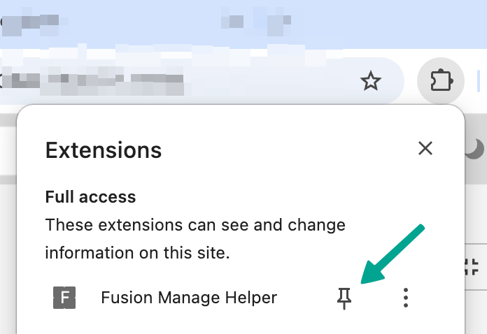
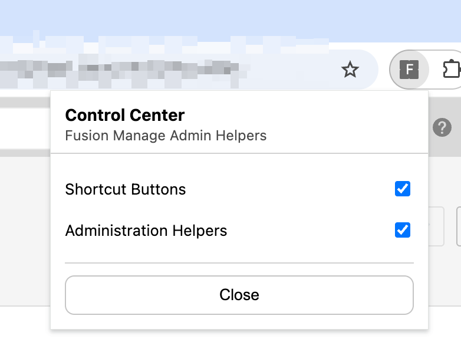
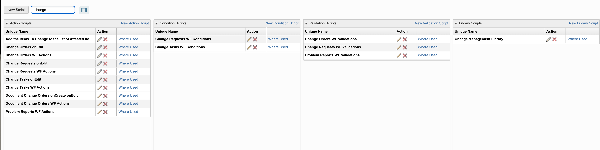

# Fusion Manage Admin Helpers

A modular Chrome Extension that enhances the Autodesk Fusion Manage admin UI with targeted productivity, usability, and navigation improvements.

This extension is designed for Fusion Manage administrators, implementation consultants, and power users who spend significant time in workspace setup and other administrative tasks.

Special thanks to **Patrick Flügge**, who originally created the first features of this extension.

---

## Overview

Fusion Manage provides a powerful and flexible PLM platform, but certain administrative workflows involve repetitive UI interactions, deep navigation, or limited bulk actions.

This extension augments the existing Fusion Manage UI at runtime, without modifying backend behavior, APIs, or data. All enhancements are client-side, non-invasive, and SPA-safe.

The focus is on:

- Reducing admin friction
- Improving discoverability and navigation
- Enabling power-user and bulk actions where the standard UI is restrictive
- Preserving Fusion Manage’s native behavior and supportability

---

## Setup Instructions

This extension is distributed as source code and must be loaded as an unpacked Chrome extension.

### Installation Steps

1. **Download the repository**

2. **Open the Chrome Extensions page**

   - Navigate to:
     ```
     chrome://extensions
     ```

3. **Enable Developer Mode**

   - Toggle **Developer mode** in the top-right corner

4. **Load the unpacked extension**

   - Click **Load unpacked**
   - Select the **root folder of the extension** (the folder containing `manifest.json`)

5. **Verify installation**

   - The extension should now appear in the list of installed extensions
   - No browser restart is required

6. **(Optional) Pin Extension for easier toggle**
   - Pin the Extension to easily access it and toggle the features you want to use

<table>
  <tr>
    <td>
      
    </td>
    <td>
      
    </td>
  </tr>
</table>

---

### Updating the Extension

After pulling updates or modifying the source code:

1. Go to `chrome://extensions`
2. Click the **Refresh** icon on the extension card
3. Reload the Fusion Manage page

---

## Features

### Shortcut Buttons

- **Settings Button**
  - Reacts on the context. When in a workspace, it goes to either Item Details, Grid or BOM settings, depending on which tab you are on.
- **Script and Role Button**
  - Always navigates to the given administration setting
- **Workflow Button**

  - Is only available when in a workspace and opens the workflow editor for the given workspace in a new tab.

<p align="center">
    
</p>

### Workspace Manager Improvements

- **Filter Workspaces**
  - Auto Expand when 2 or less workspaces match the criteria
- **Layout Optimization**

  - Display Workspace ID for easier copy possiblity
  - Quicklink Buttons to open the given setting in a new tab

<p align="center">
    
</p>

- **Expert Mode**
  - Moves the most important settings into the header of the workspace for easy access
  - Disables the auto-expand when 2 or less hits on filtering the workspace

<p align="center">
    
</p>

### Item Details Improvements

- **Filter Item Details**
  - Hides item details not matching filter and jumps to the next instance by hitting Enter
- **Expand All / Collapse All sections**

  - One-click expansion or collapse of all workspace setup sections

- **Layout Optimization**

  - Move Edit, Clone and Delete Button next to Item Details Name
  - Add FieldID next to the Item Details Name
  - Click FieldID to copy it to clipboard

<p align="center">
    
</p>

### Security Administration Improvements

- **Table Filtering for Roles, Groups, Users**

  - Hide Roles, Groups or Users that do not match the filter criteria

- **Layout Optimization**

  - Reordered action columns for better usability

<p align="center">
    
</p>

- **Improved Selection Screen**
  - _Add All_ and _Remove All_ buttons to quickly move all options at once
  - Increased size for the window itself to list more options at once and reduce scrolling need

<p align="center">
    
</p>

### Scripting and Picklist Manager Improvements

- **Filter Results**
  - Hides items that do not match the filter
- **Layout Optimization**
  - Put Action scripts to the top as they are the most used
  - Move the action columns further to the front for better usability
  - Click on the script name to open it in a new tab

<p align="center">
    
</p>

- **Script Grid Mode**

  - Switches between a list of all scripts and a grid layout

    <p align="center">
      
  </p>

---

## Architecture

The extension is built using a modular **Manifest V3** architecture, designed for long-term maintainability and incremental feature growth.

### High-level structure

- **Global namespace**

  - All functionality lives under a single `window.FM` namespace
  - Prevents collisions with Fusion Manage or other extensions

- **Bootstrap loop**

  - A central `mainTick` continuously evaluates application context
  - Features activate only when their target UI is present

- **SPA-safe by design**
  - Uses observers and defensive DOM checks
  - Handles Fusion Manage re-renders and lazy loading reliably

---

## Safety and Supportability

- Works with Google Chrome and Chromium-based browsers (Microsoft Edge, Brave)
- No backend calls
- No data persistence
- No interference with Fusion Manage APIs
- Fully client-side
- Easily removable by disabling the extension
- Google

**The extension is intended for internal use, demos, POCs, and admin power users, not as a replacement for standard product functionality.**

---

## Disclaimer

**This extension is not an official Autodesk product feature.**

It does not modify Fusion Manage data, behavior, or supported configurations.

Use responsibly, especially in regulated or validated environments.
