# Fusion Manage Admin Helpers

A modular Chrome Extension that enhances the Autodesk Fusion Manage admin UI with targeted productivity, usability, and navigation improvements.

This extension is designed for Fusion Manage administrators, implementation consultants, and power users who spend significant time in workspace setup and other administrative tasks.

Special thanks to **Patrick Flügge**, who originally created the first features of this extension.

## Table of Contents

- [Overview](#overview)
- [Setup Instructions](#setup-instructions)
- [Features](#features)
  - [Shortcut Buttons](#shortcut-buttons)
  - [Workspace Manager Improvements](#workspace-manager-improvements)
  - [Item Details Improvements](#item-details-improvements)
  - [Security Administration Improvements](#security-administration-improvements)
  - [Scripting and Picklist Manager Improvements](#scripting-and-picklist-manager-improvements)
- [Architecture](#architecture)
- [Safety and Supportability](#safety-and-supportability)
- [Disclaimer](#disclaimer)

---

## Overview

Fusion Manage provides a powerful and flexible PLM platform, but certain administrative workflows involve repetitive UI interactions, deep navigation, or limited bulk actions.

This extension augments the existing Fusion Manage UI at runtime, without modifying backend behavior, APIs, or data. All enhancements are client-side, non-invasive, and SPA-safe.

The focus is on:

- Reducing admin friction
- Improving discoverability and navigation
- Enabling power-user and bulk actions where the standard UI is restrictive
- Preserving Fusion Manage’s native behavior and supportability

---

## Setup Instructions

This extension is distributed as source code and must be loaded as an unpacked Chrome extension. The loadable package lives in the **`dist`** folder within the repository.

### Installation Steps

1. **Download the repository**

2. **Open the Chrome Extensions page**

   - Navigate to:
     ```
     chrome://extensions
     ```

3. **Enable Developer Mode**

   - Toggle **Developer mode** in the top-right corner

4. **Load the unpacked extension**

   - Click **Load unpacked**
   - Select the **`dist` folder** inside the repository (the folder that contains `manifest.json`)

5. **Verify installation**

   - The extension should now appear in the list of installed extensions
   - No browser restart is required

6. **(Optional) Pin Extension for easier toggle**
   - Pin the Extension to easily access it and toggle the features you want to use

<table>
  <tr>
    <td>
      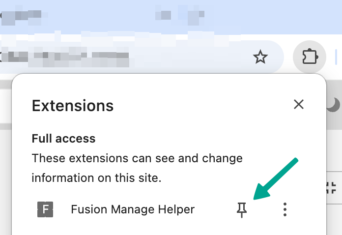
    </td>
    <td>
      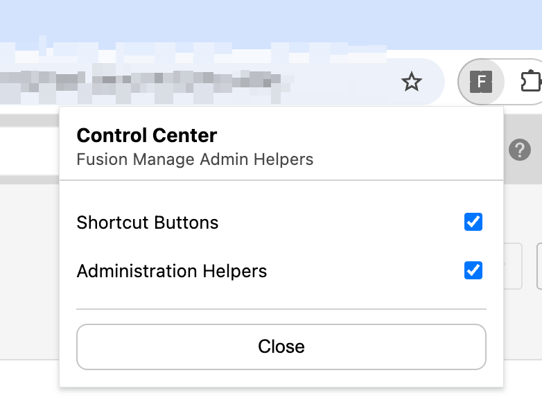
    </td>
  </tr>
</table>

---

### Updating the Extension

After pulling updates or modifying extension files under **`dist/`**:

1. Go to `chrome://extensions`
2. Click the **Refresh** icon on the extension card
3. Reload the Fusion Manage page

---

## Features

### Shortcut Buttons

- **Admin Shortcuts**

  - This shortcut reacts on the context of the workspace the user is in and only is visible when within a workspace. If the user is in a workspace it displays the quick links to the workspace manager settings for this given workspace and opens them in a new tab.

  <p align="center">
    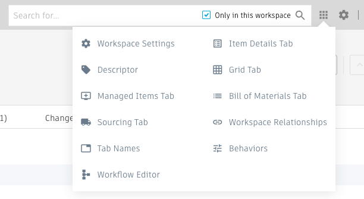
  </p>

- **Settings Shortcut**

  - Clicking the settings shortcuts button opens up a sub-menu that allows the user to jump the most used areas of the administration. These are the general settings, the workspace manager, scripts and the security settings with users, groups and roles.

  <p align="center">
    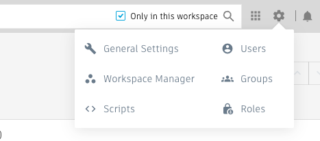
  </p>

- **Field ID Toggle**

  - When the user is within the item details tab, a toggle appears that if activated, replaces the field values with their given unique FieldID and also adds the option to copy the given FieldID to the clipboard when clicking on it.

  <p align="center">
    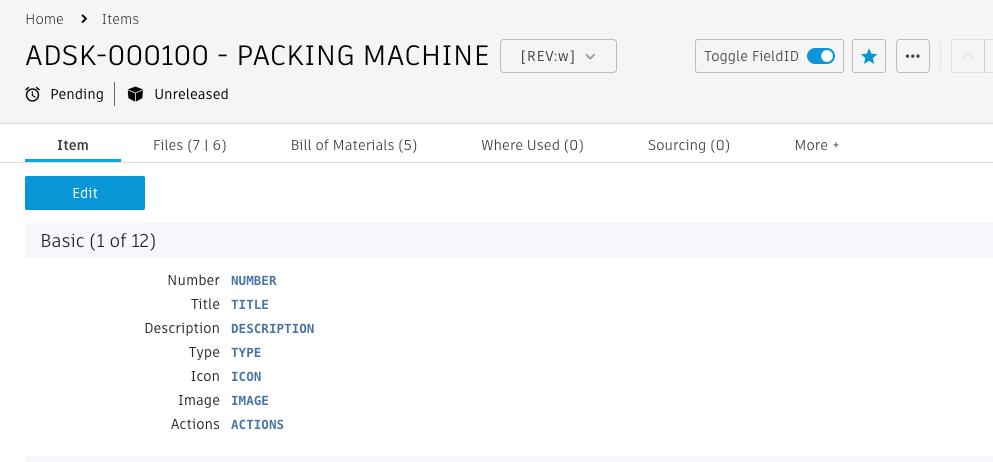
  </p>

- **Administration Shortcuts**

  - When in the admin UI, the user has the option to jump to the workspace manager, scripts or the roles easily. In addition, when the user is in sub section of the workspace manager, like the item details, a new menu option will appear. This dropdown contains the regular Admin Shortcuts that are known from the frontend, as well as two more options. One for adding a new item to the workspace, in case the user wants to test out the creation dialogue, and another option that opens up the workspace view.

  <p align="center">
    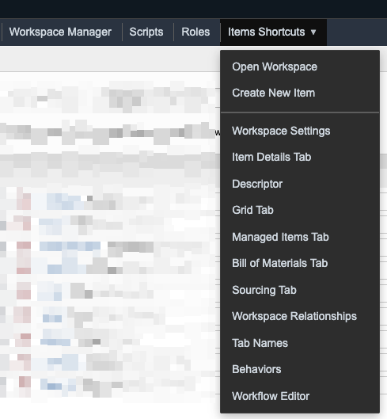
  </p>

### Workspace Manager Improvements

- **Filter Workspaces**
  - Auto Expand when 2 or less workspaces match the criteria
- **Layout Optimization**

  - Display Workspace ID for easier copy possibility
  - Quicklink Buttons to open the given setting in a new tab

- **Compact List Mode**
  - Moves the most important settings into the header of the workspace for easy access
  - Disables the auto-expand when 2 or less hits on filtering the workspace

<p align="center">
    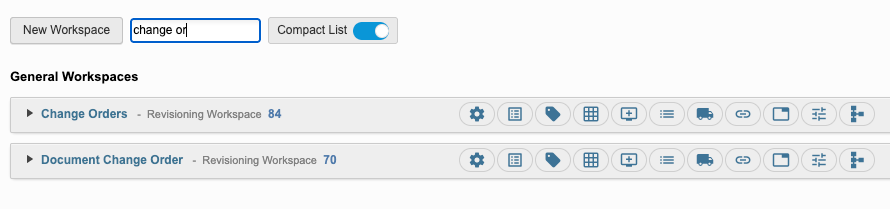
</p>

### Item Details Improvements

- **Filter Item Details**
  - Hides item details not matching filter and jumps to the next instance by hitting Enter
- **Expand All / Collapse All sections**

  - One-click expansion or collapse of all workspace setup sections

- **Layout Optimization**

  - Move Edit, Clone and Delete Button next to Item Details Name
  - Add FieldID next to the Item Details Name
  - Click FieldID to copy it to clipboard

<p align="center">
    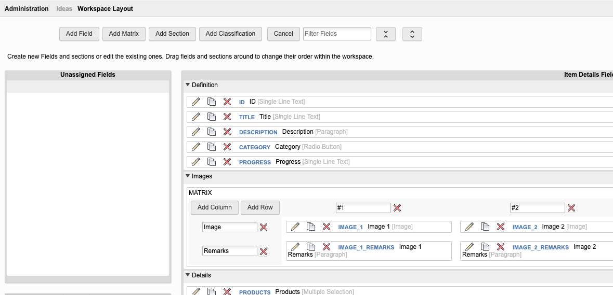
</p>

### Security Administration Improvements

- **Table Filtering for Roles, Groups, Users**

  - Hide Roles, Groups or Users that do not match the filter criteria

- **Layout Optimization**

  - Reordered action columns for better usability

<p align="center">
    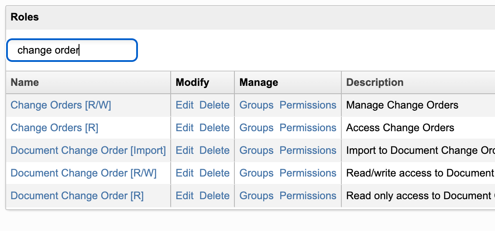
</p>

- **Improved Selection Screen**
  - _Add All_ and _Remove All_ buttons to quickly move all options at once
  - Increased size for the window itself to list more options at once and reduce scrolling need

<p align="center">
    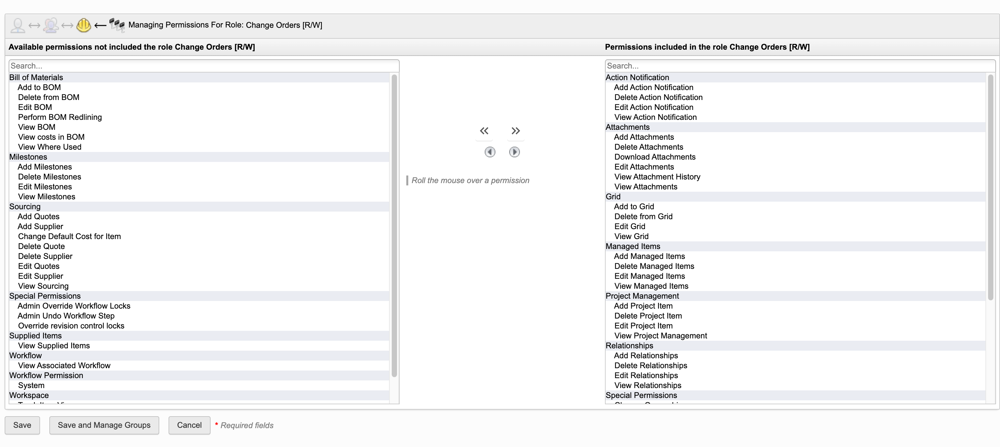
</p>

### Scripting and Picklist Manager Improvements

- **Filter Results**
  - Hides items that do not match the filter
- **Layout Optimization**
  - Put Action scripts to the top as they are the most used
  - Move the action columns further to the front for better usability
  - **Click on the script name to open it in a new tab**

<p align="center">
    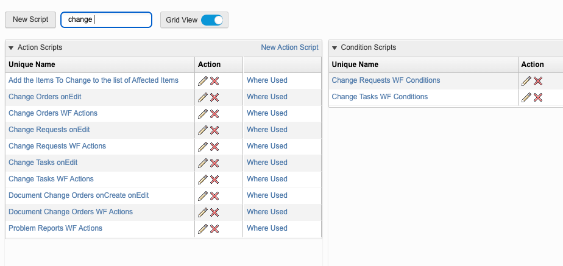
</p>

### Script Editor Enhancements

- Added _Copy to Clipboard and Save_ Button to prevent mistakes from happening
- After saving with the new button, the script editor jumps back to the position it was at before
- Added the option to open Library Scripts directly from within the script editor by simply clicking on it
- Insert Snippet option to add code snippets to where the cursor is or replace existing marked code with it
- Function Overview that lists all the functions that are defined within the current script with the option to easily navigate to them by clicking the given function
  <p align="center">
    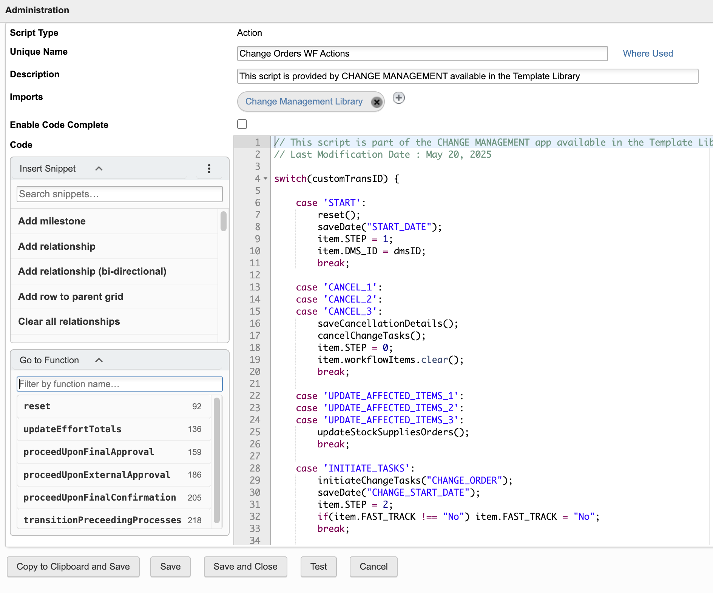
</p>

**Snippet Mananager**

- To manage the snippets, the user can click the actions icon on the right of the insert snippet button
- This allows the user to either get to the snippet management, or to add a new snippet with the code marked in the code editor
- The snippet editor window itself allows to manage existing snippets, pull in a default configuration or export and import snippets as json files to share them with colleagues

  <p align="center">
  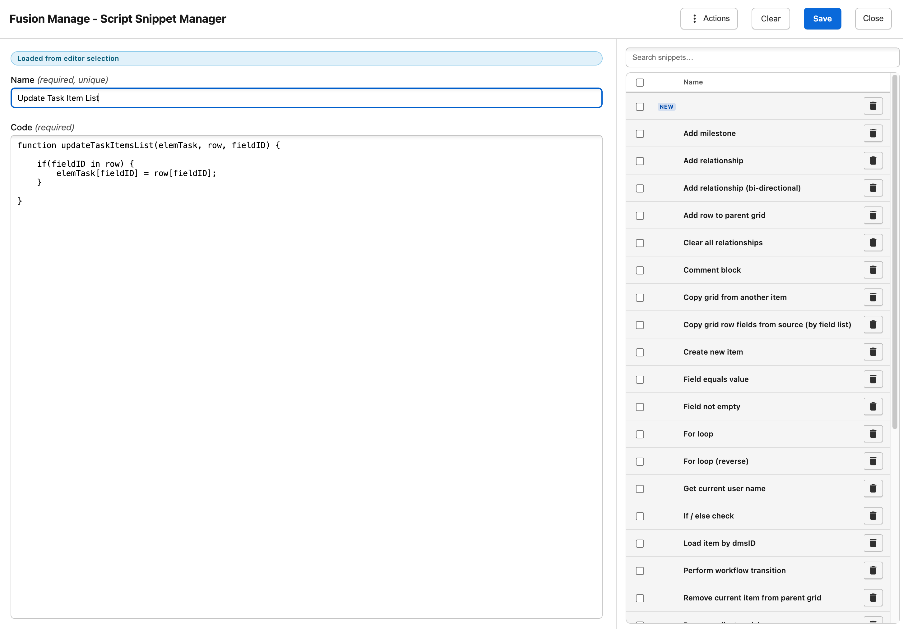
</p>

### Other Improvements

- **Change Tab Names within Administration for better overview**
  - Applies to Scripts, Workspace Manager and Security Settings
    <p align="center">
      
  </p>

---

## Architecture

The extension is built using a modular **Manifest V3** architecture, designed for long-term maintainability and incremental feature growth.

### Repository layout

- **`dist/`** — Unpacked extension: `manifest.json`, content scripts, popup, options page, and bundled data. Point Chrome’s **Load unpacked** at this directory.
- **`images/`** — Screenshots referenced by this README (not loaded by the extension).

### High-level structure

- **Global namespace**

  - All functionality lives under a single `window.FM` namespace
  - Prevents collisions with Fusion Manage or other extensions

- **Bootstrap loop**

  - A central `mainTick` continuously evaluates application context
  - Features activate only when their target UI is present

- **SPA-safe by design**
  - Uses observers and defensive DOM checks
  - Handles Fusion Manage re-renders and lazy loading reliably

---

## Safety and Supportability

- Works with Google Chrome and Chromium-based browsers (Microsoft Edge, Brave)
- No backend calls
- No data persistence
- No interference with Fusion Manage APIs
- Fully client-side
- Easily removable by disabling the extension

**The extension is intended for internal use, demos, POCs, and admin power users, not as a replacement for standard product functionality.**

---

## Disclaimer

**This extension is not an official Autodesk product feature.**

It does not modify Fusion Manage data, behavior, or supported configurations.

Use responsibly, especially in regulated or validated environments.
